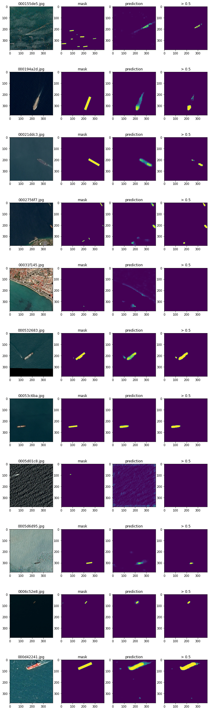

# Image Segmentation with airbus-ship-detection

## Code

- Exploratory data analysis:
	 - `Data Exploration.ipynb`
- Training:
	- `Training.ipynb`
	- training.py
- Testing:
	- `Testing.ipynb`
	- test.py
	- `QuickEvaluation.ipynb` - evaluation of different models

## Solution

### Unet

Used a smaller version of Unet architecture (less convolution filters). Used code from [here](https://www.machinelearningnuggets.com/image-segmentation-with-u-net-define-u-net-model-from-scratch-in-keras-and-tensorflow/)

Accepts images `348x348` (half of the original dimensions)

### Data preprocessing

- rescaling (obviously)
- normalization
- slight median blur

### Training\Validation

- used only images with ships for training
- first half of the data (alphabetically - the first half of the directory) - training, the second half - validation
- training took ~ 3 hours

## Results

best model is `./models/ModelS.h5`
preprocessing - `module.transform.normalize_rescale_blur`

||validation|total|
|-|-|-|
|dice loss|0.4993|0.859|

